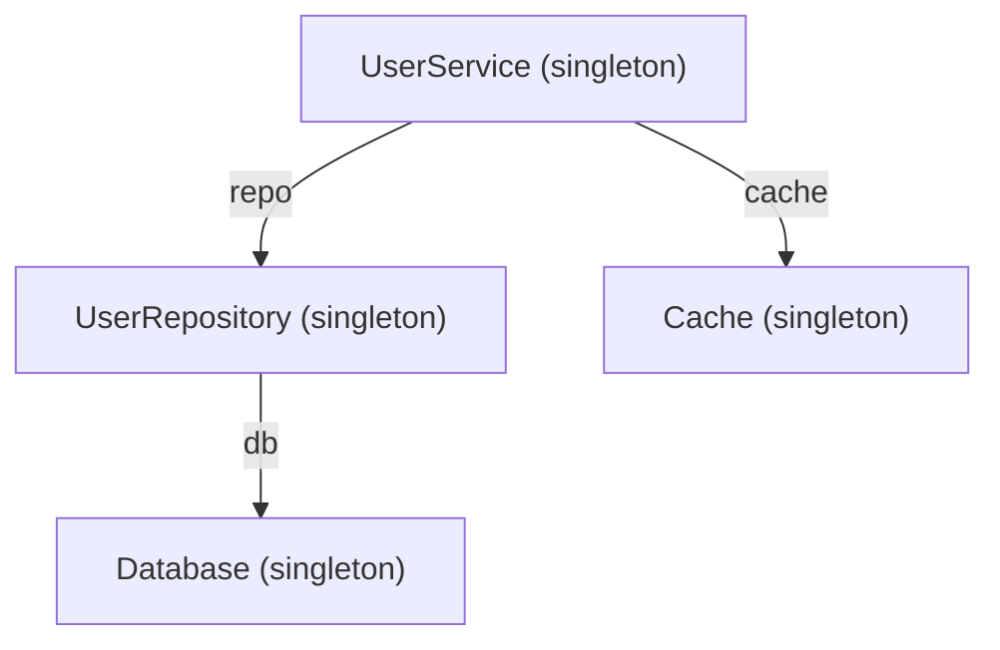
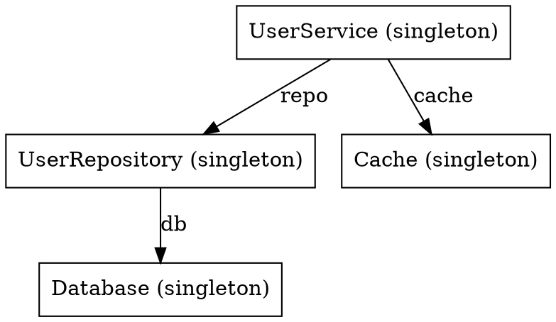

# Command Line Interface

AnyDI provides a CLI tool to visualize your dependency graph.

## Basic Usage

```shell
anydi myapp.container:container
```

This command loads the container from `myapp/container.py` and prints the dependency tree.

You can also use a factory function that returns a container:

```shell
anydi myapp.container:create_container
```

## Output Formats

### Plain Text (Default)

Shows dependencies as a tree:

```shell
anydi myapp:container
```

Output:

```
UserService (singleton)
├── repo: UserRepository (singleton)
│   └── db: Database (singleton)
└── cache: Cache (singleton)
```

### Mermaid

Generate [Mermaid](https://mermaid.js.org/) diagram:

```shell
anydi myapp:container -o mermaid
```

Output:



#### Render with mermaid-cli

Install [mermaid-cli](https://github.com/mermaid-js/mermaid-cli):

```shell
npm install -g @mermaid-js/mermaid-cli
```

Generate PNG image:

```shell
anydi myapp:container -o mermaid | mmdc -i - -o graph.png
```

Generate SVG:

```shell
anydi myapp:container -o mermaid | mmdc -i - -o graph.svg
```

### DOT (Graphviz)

Generate [Graphviz](https://graphviz.org/) DOT format:

```shell
anydi myapp:container -o dot
```

Output:



#### Render with Graphviz

Install Graphviz:

=== "macOS"

    ```shell
    brew install graphviz
    ```

=== "Ubuntu/Debian"

    ```shell
    apt install graphviz
    ```

=== "Windows"

    ```shell
    choco install graphviz
    ```

Generate PNG image:

```shell
anydi myapp:container -o dot | dot -Tpng -o graph.png
```

Generate SVG:

```shell
anydi myapp:container -o dot | dot -Tsvg -o graph.svg
```

### JSON

Generate JSON for custom processing:

```shell
anydi myapp:container -o json
```

Output:

```json
{
  "nodes": [
    {"dependency_type": "UserService", "scope": "singleton", "from_context": false},
    {"dependency_type": "UserRepository", "scope": "singleton", "from_context": false},
    {"dependency_type": "Database", "scope": "singleton", "from_context": false}
  ],
  "links": [
    {"source": "UserService", "target": "UserRepository", "label": "repo"},
    {"source": "UserRepository", "target": "Database", "label": "db"}
  ]
}
```

Save to file:

```shell
anydi myapp:container -o json > graph.json
```

Custom indentation:

```shell
anydi myapp:container -o json --indent 4 > graph.json
```

## Options

### Full Module Path

Show full module paths in output:

```shell
anydi myapp:container --full-path
```

Output:

```
myapp.services.UserService (singleton)
└── repo: myapp.repositories.UserRepository (singleton)
    └── db: myapp.database.Database (singleton)
```

### Scan Packages

Scan packages for providers before generating graph:

```shell
anydi myapp:container --scan myapp.services myapp.repositories
```

Or use short form:

```shell
anydi myapp:container -s myapp.services -s myapp.repositories
```

## All Options

| Option            | Short | Description                                      |
|-------------------|-------|--------------------------------------------------|
| `--output-format` | `-o`  | Output format: `plain`, `mermaid`, `dot`, `json` |
| `--full-path`     |       | Show full module paths                           |
| `--indent`        | `-i`  | JSON indentation (default: 2)                    |
| `--scan`          | `-s`  | Packages to scan for providers                   |
